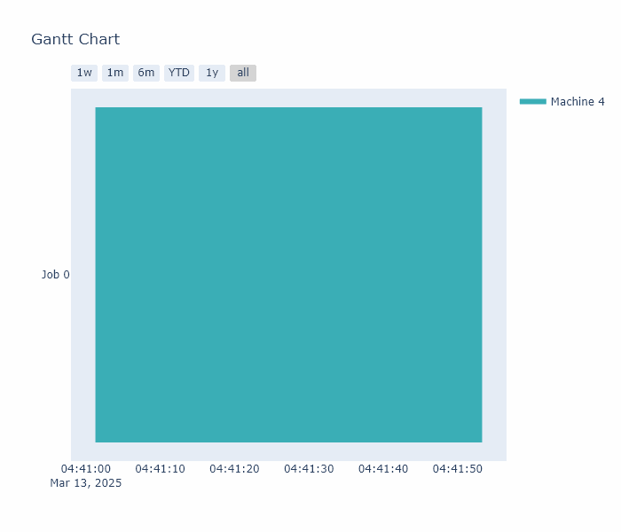
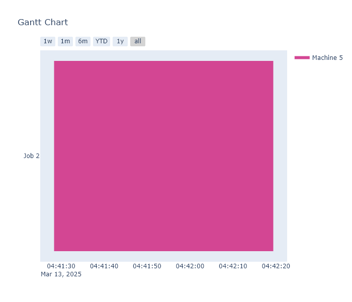
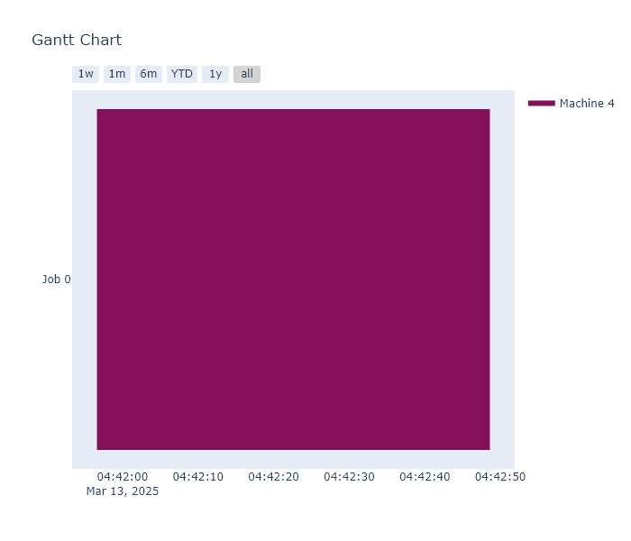

# Final Year Project - Dynamic Job-Shop Scheduling Environment 
An optimized OpenAi gym's environment to simulate the Dynamic Job Shop Scheduling Problem

Results 
------------
I have implemented 3 most common dispatching rule in my dynamic JSSP environment. 
1. First in first out (FIFO)

3. S/RPT + SPT (Job Slack/Remaining Processing Time) combined with Shortest Processing Time

5. Most Total Work Remaining (MTWR)

Project Organization
------------

    ├── README.md             <- The top-level README for developers using this project.
    ├── JSSEnv
    │   └── envs              <- Contains the environment.
    │       └── instances     <- Contains some intances from the litterature.
    │
  
--------

## License

MIT License
